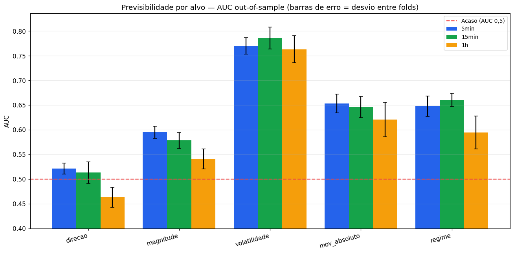
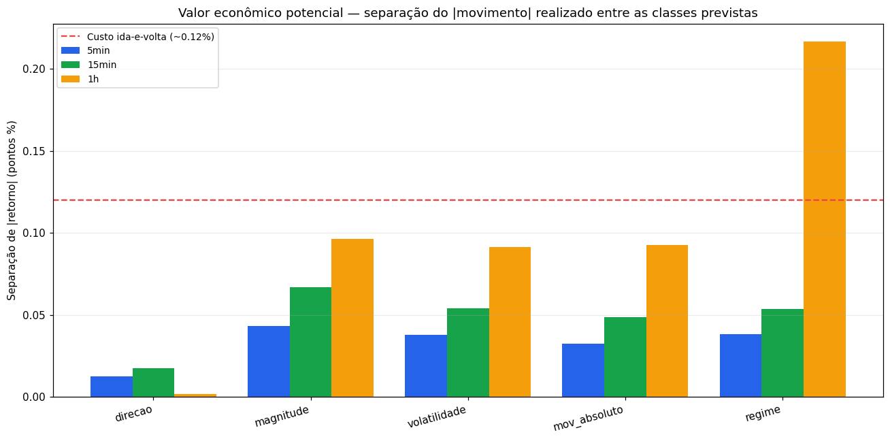
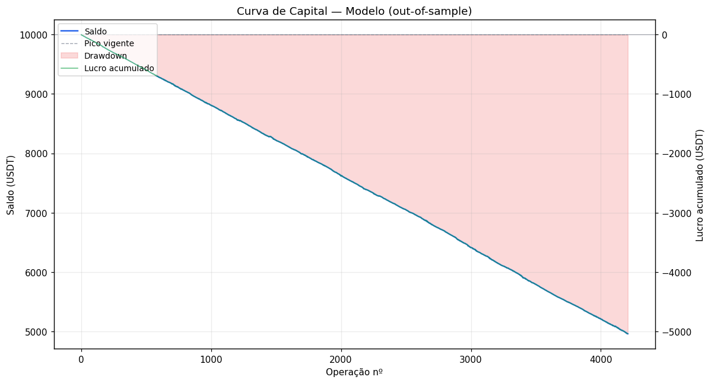

# Previsibilidade ≠ Lucratividade
### Um framework de validação estatística e econômica de hipóteses de mercado — estudo de caso BTC/USDT

[](https://github.com/caiogoia123/alpha-validation-lab/actions/workflows/ci.yml)


[English](README.md) · 🌐 **Português**

> **Resumo** — Prever a **direção** do Bitcoin é estatisticamente indistinguível
> de cara-ou-coroa depois dos custos. A **volatilidade** parece altamente
> previsível (AUC ≈ 0,79)… até uma *validação cruzada purgada* mostrar que um
> baseline trivial de uma linha **vence o XGBoost**. Este repositório é uma
> investigação disciplinada e reprodutível sobre **o que é de fato previsível
> em mercados — e por que previsibilidade ainda assim não paga.**

Isto **não** é um robô de trading. É um **framework de pesquisa** que pega uma
hipótese popular ("ML prevê a direção do BTC"), tenta arduamente *falsificá-la*,
segue a evidência até onde o sinal realmente existe e então estressa esse achado
até ele quebrar. O resultado principal é *negativo* — entregue com o rigor que
resultados negativos merecem.

---

## ⏱ Resultados em 30 segundos

| Hipótese sob teste | Veredito | Evidência |
|---|---|---|
| A **direção** do BTC é previsível | ❌ **Rejeitada** | AUC ≈ 0,50; em 250k candles um edge *estatisticamente* real de 51,2% (p=0,002) perde **−150%** após custos |
| Mudar o **horizonte** resolve | ❌ **Rejeitada** | 5 min → 4 h falham: horizonte curto tem sinal mas movimento < custo; horizonte longo tem movimento > custo mas sem sinal |
| A **volatilidade** é previsível | ✅ **Confirmada**… | AUC ≈ 0,79, estável de 8k→250k candles, Lift@10% ≈ 3× |
| …e isso é mérito do **modelo** | ❌ **Rejeitada** | Sob **CV purgada**, um baseline trivial de *persistência* (AUC 0,81) **vence** o XGBoost (0,74). Era clustering de volatilidade o tempo todo. |
| Alguma estratégia simples é **lucrativa** | ❌ **Rejeitada** | **Deflated Sharpe Ratio = 0,00** em 12 configurações |

**Três números que resumem o projeto:** `AUC de direção ≈ 0,50` · `custo ida-e-volta
0,12% > movimento mediano de 5 min 0,05%` · `Deflated Sharpe ≈ 0,00`.



---

## 1. Motivação

ML financeiro está afogado em resultados positivos que não sobrevivem ao contato
com dados fora da amostra, custos de transação ou correção por múltiplos testes.
O projeto de portfólio mais comum — *"meu modelo prevê BTC com 90% de acurácia"* —
é quase sempre vazamento de dados (leakage).

Este projeto inverte o incentivo. O objetivo nunca foi *confirmar* que o BTC é
previsível; foi descobrir **se é, e a que custo** — e ser honesto quando a
resposta é não.

## 2. Perguntas de pesquisa

1. A **direção** do preço do BTC é previsível fora da amostra, após custos?
2. O **horizonte** de previsão (5 min → 4 h) muda a resposta?
3. Se não a direção, **o que** *é* previsível?
4. A previsibilidade estatística se traduz em **valor econômico**?
5. Algum achado **sobrevive** à validação cruzada purgada e à correção de viés de seleção?

## 3. Metodologia

| Componente | Escolha |
|---|---|
| **Dados** | Binance BTC/USDT OHLCV, 1 minuto, até **250k candles (~174 dias)**, em SQLite (ingestão idempotente). Ver [`docs/DATA_CARD.md`](docs/DATA_CARD.md). |
| **Features** | RSI, MACD, EMA9, EMA21 (+ retorno de 1 barra, variação de volume) — deliberadamente fixas em todos os experimentos como *controle*. Ver [`docs/MODEL_CARD.md`](docs/MODEL_CARD.md). |
| **Modelo** | Um único classificador **XGBoost**, reutilizado para todo alvo (direção, magnitude, volatilidade, regime). O modelo nunca muda entre estudos — a *variável independente é o alvo*. |
| **Validação** | Split temporal (sem shuffle), walk-forward, **K-fold purgado e com embargo** (López de Prado), **amostragem não-sobreposta** para significância, intervalos de Wilson, testes z, **Deflated Sharpe Ratio** (Bailey & López de Prado). |
| **Economia** | Modelo de custo explícito (taxa taker + slippage ≈ 0,12% ida-e-volta), saídas por tempo e SL/TP, profit factor, expectância, drawdown. |

## 4. Principais achados

**A direção é ruído.** Em todos os horizontes e tamanhos de amostra
(8k / 100k / 250k), o AUC direcional fica em ≈ 0,50. O único edge significativo
(51,2% em 5 min, p=0,002, visível *só* com 250k candles) é economicamente inútil:
perde ~150% para custos, porque o movimento mediano de 5 minutos (~0,05%) é
**menos da metade do custo de ida-e-volta (~0,12%)**.



*Quanto de movimento de preço as classes previstas de cada alvo realmente separam,
vs. o custo de ida-e-volta (linha vermelha tracejada ≈ 0,12%). A direção mal aparece —
só um sinal de regime em 1 h supera a linha de custo.*

**A volatilidade é previsível — trivialmente.** A volatilidade é o alvo mais
previsível por larga margem (AUC ≈ 0,79 vs. 0,50 da direção). Mas isso é o efeito
clássico de *clustering de volatilidade*: sob CV purgada, um baseline de
persistência de uma linha (`vol_{t+1} ≈ vol_t`, AUC 0,81) **supera** o XGBoost
(0,74). O modelo de ML agrega valor **negativo** sobre uma regra trivial.

**Previsibilidade ≠ lucratividade.** Mesmo usando o sinal de volatilidade como
*filtro* para operar só em regimes de movimento alto melhora o profit factor (ao
remover operações dominadas por custo), mas nunca produz uma estratégia
lucrativa. O **Deflated Sharpe Ratio nas 12 configurações é 0,00** — o melhor
resultado é exatamente o esperado ao testar muitas estratégias sem edge real.



*O resumo em um gráfico: fora da amostra, o saldo do modelo cai de 10.000 USDT para
~5.000 ao longo de ~4.200 operações. O edge estatístico é real — e ainda assim negativo
após os custos.*

## 5. As armadilhas metodológicas (a parte interessante)

Pesquisa de verdade é, em grande parte, *não se enganar*. Três momentos em que a
resposta ingênua estava errada:

- **Janelas sobrepostas inflam a significância.** Para um horizonte de 4 h em
  barras de 1 min, rótulos consecutivos compartilham 239/240 do futuro → enorme
  autocorrelação. Tratar as previsões como independentes deu um **p = 0,000
  espúrio**; corrigir para amostras não-sobrepostas (≈ N/H observações
  independentes) deu **p = 0,53**. O "edge" era um artefato da contagem de amostras.
- **Um baseline trivial venceu o modelo de ML.** O celebrado AUC 0,79 só parecia
  impressionante até ser comparado, sob CV purgada, com a persistência. Sempre
  corra seu modelo contra o preditor mais burro possível.
- **Um teste de unidade pegou um bug de vazamento de rótulo.** O
  `test_no_leakage.py` flagrou que as últimas *H* linhas (sem futuro observável)
  eram silenciosamente rotuladas `0` em vez de descartadas — porque `NaN > x` é
  `False` no pandas. Corrigido, com teste de regressão.

## 6. Limitações e ameaças à validade

Ditas com todas as letras, porque fingir que não existem é a jogada amadora:

- **Um ativo, uma corretora, um período.** Os achados são demonstrados em
  BTC/USDT spot; generalização para outros ativos/regimes é trabalho futuro.
- **Conjunto de features orientado à direção.** Sem feature explícita de
  volatilidade (ATR, vol realizada) — que é *por que* o baseline trivial de vol
  vence. Um conjunto de features nativo de vol ficou de fora de propósito
  (comparação controlada).
- **Custos são modelados, não medidos.** Fills reais, rebates de maker e posição
  na fila mudariam a economia (provavelmente para melhor em frequência menor).
- **Sem dados de order-flow / L2.** A única fonte de informação com valor
  direcional documentado em horizonte curto está ausente por escolha.

## 7. Reprodutibilidade

```bash
pip install -e ".[dev]"        # instala o pacote + ferramentas de dev
make test                      # 25 testes, lógica numérica central
make data                      # baixa 250k candles da Binance -> SQLite
make experiments               # estudos de direção / horizonte / alvos
make validate                  # CV purgada + Deflated Sharpe
```

Tudo é config-driven e com seed; relatórios e figuras se regeneram em
[`reports/`](reports/).

## 8. Estrutura do projeto

```
src/
├── data/          # cliente Binance + store SQLite (ingestão idempotente)
├── features/      # RSI, MACD, EMA — causais, testados
├── model/         # treino XGBoost / construção de dataset (sem leakage)
├── backtest/      # motor consciente de custo, métricas, estratégias baseline
├── experiments/   # estudo de horizonte, estudo de alvos, validade estatística
├── economics/     # valor econômico do sinal de volatilidade
└── validation/    # CV purgada, Deflated Sharpe, baseline de persistência
tests/             # indicadores, no-leakage, motor, métricas, CV purgada
reports/           # markdown + figuras gerados automaticamente
```

## 9. Roadmap

- **v0.1 — MVP:** pipeline, XGBoost, backtest, estudos de direção/horizonte/alvos.
- **v0.2 — Pronto para portfólio (este release):** testes + CI, CV purgada,
  Deflated Sharpe, baseline de persistência, README hero, model/data cards.
- **v0.3 — Profundidade de pesquisa:** framework agnóstico de hipótese e
  multi-ativo; estudo de carry/funding; experiment tracking; relatório escrito.
- **v0.4 — Plataforma:** Docker, site de docs, pipeline de dados com DVC.

## 10. O que este projeto demonstra

Desenho de hipótese · disciplina out-of-sample · realismo de custos de transação ·
testes de significância cientes de autocorrelação · validação cruzada purgada ·
correção de viés de seleção (Deflated Sharpe) · reporte honesto de resultados
negativos. A habilidade em exibição é **saber validar uma afirmação**, não
produzir um número.

## Referências

- M. López de Prado, *Advances in Financial Machine Learning* (2018) — CV purgada, embargo.
- D. Bailey & M. López de Prado, *The Deflated Sharpe Ratio* (2014).
- C. Harvey & Y. Liu, *Backtesting* / múltiplos testes em finanças (2015).

## Licença

MIT — uso de pesquisa/educacional. **Não é recomendação financeira.** Ver
[LICENSE](LICENSE) e [CITATION.cff](CITATION.cff).

---

## Autor

**Caio Goia** — Analytics Engineer · BI Analyst. Construo pipelines de dados e transformo dados em decisão.

[](https://github.com/caiogoia123)
[](https://www.linkedin.com/in/caio-goia/)
