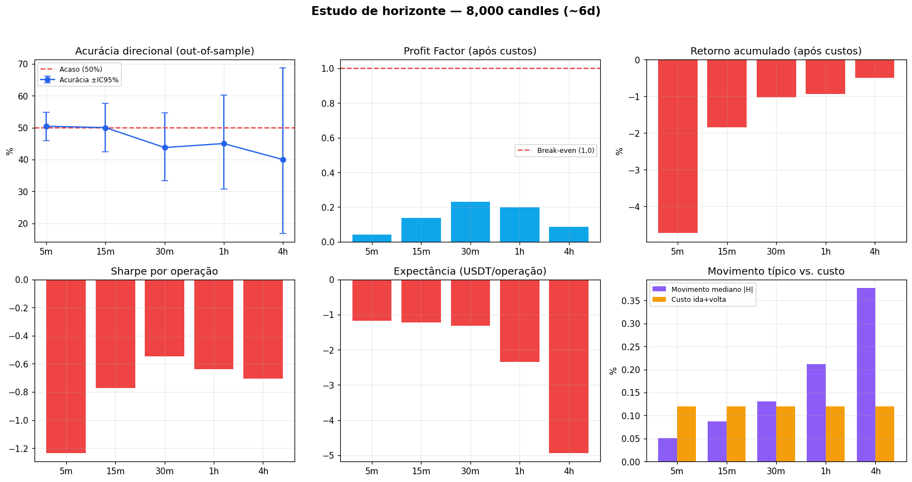
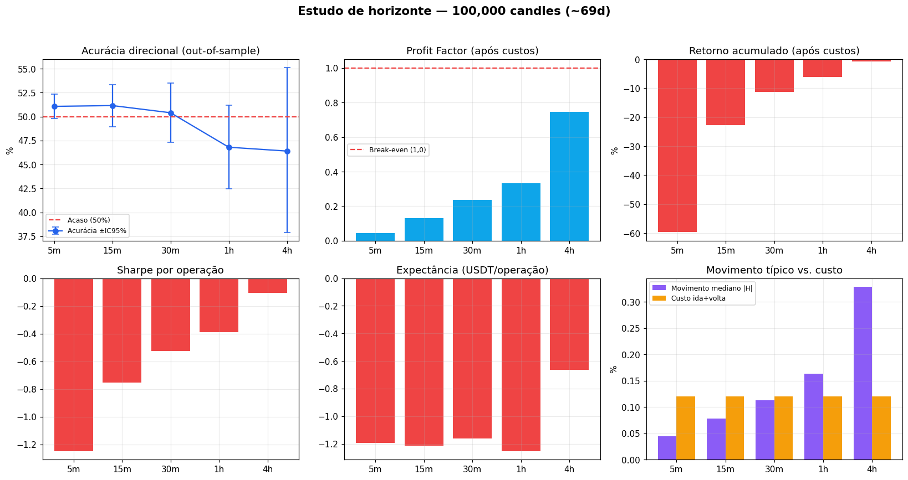
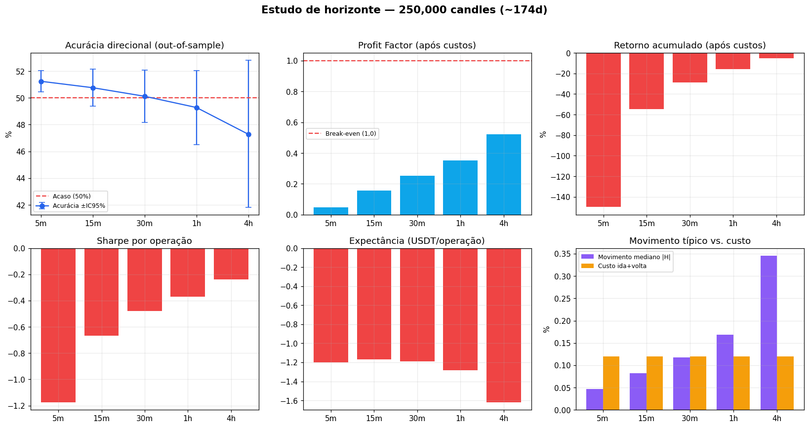
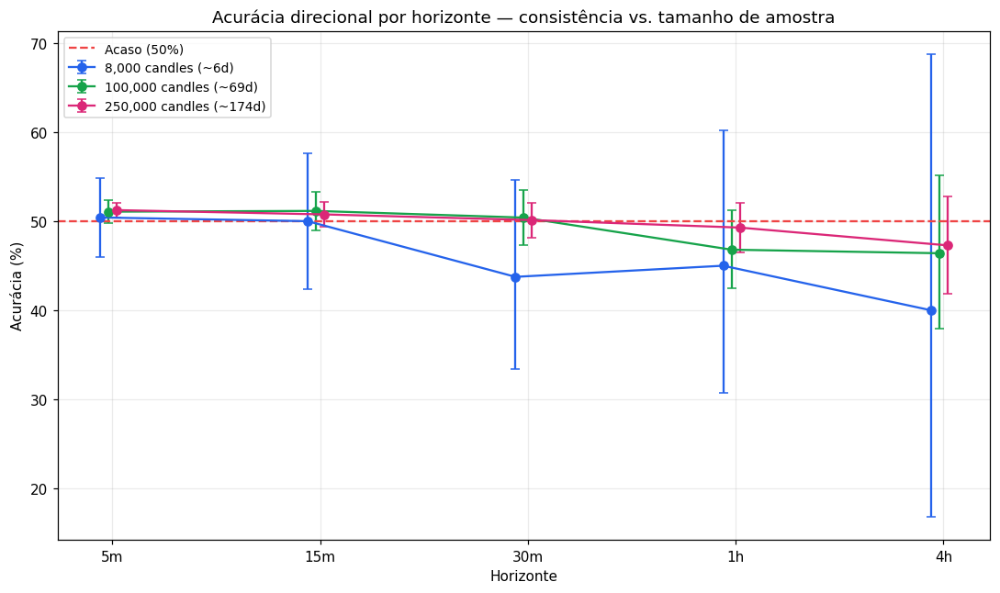

# Estudo de Horizonte Temporal — BTC/USDT

_Gerado em 2026-06-01 20:39:12._

> Experimento controlado: **mesmo dataset, mesmos indicadores, mesmo XGBoost, mesmo pipeline e mesmo backtest**. A única variável manipulada é o **horizonte de previsão** (5, 15, 30, 60 e 240 min). Para cada horizonte a posição é mantida exatamente por H candles (saída por tempo, sem bracket), com os mesmos custos (taxa + slippage).

## 1. Validade estatística e tamanho de amostra

> **Janelas sobrepostas (ponto crítico).** Com candles de 1 min, duas previsões consecutivas de horizonte *H* compartilham *(H−1)/H* do futuro — logo são fortemente autocorrelacionadas. Tratar todas as previsões como independentes infla artificialmente o N e produz intervalos de confiança e p-valores espúrios. **Todas as estatísticas abaixo usam apenas amostras não-sobrepostas (uma a cada *H* candles), ≈ N/H observações de fato independentes.**

A acurácia direcional é uma proporção binomial; a margem de erro a 95% em torno de 50% define o **menor edge distinguível do acaso**. Como o N independente cai com o horizonte, a confiabilidade depende de *cada combinação* tamanho × horizonte:

| Amostra | Horizonte | N independente | Margem de erro (95%) | Confiabilidade |
|---|---|---:|---:|---|
| 8,000 candles (~6d) | 5min | 480 | ±4.47pp | baixa |
| 8,000 candles (~6d) | 15min | 160 | ±7.75pp | baixa |
| 8,000 candles (~6d) | 30min | 80 | ±10.96pp | baixa |
| 8,000 candles (~6d) | 1h | 40 | ±15.49pp | baixa |
| 8,000 candles (~6d) | 4h | 10 | ±30.99pp | baixa |
| 100,000 candles (~69d) | 5min | 6,000 | ±1.27pp | moderada |
| 100,000 candles (~69d) | 15min | 2,000 | ±2.19pp | baixa |
| 100,000 candles (~69d) | 30min | 1,000 | ±3.10pp | baixa |
| 100,000 candles (~69d) | 1h | 500 | ±4.38pp | baixa |
| 100,000 candles (~69d) | 4h | 125 | ±8.77pp | baixa |
| 250,000 candles (~174d) | 5min | 15,000 | ±0.80pp | moderada |
| 250,000 candles (~174d) | 15min | 5,000 | ±1.39pp | moderada |
| 250,000 candles (~174d) | 30min | 2,500 | ±1.96pp | moderada |
| 250,000 candles (~174d) | 1h | 1,250 | ±2.77pp | baixa |
| 250,000 candles (~174d) | 4h | 313 | ±5.54pp | baixa |

Para detectar um edge de **+1pp** (51% vs 50%) com 95%/80% de poder são necessárias **~19,620 observações independentes**; para **+2pp**, **~4,904**. No horizonte de 4h, cada observação independente consome 240 candles — então ~4,904 observações exigiriam ~1,176,960 candles de 1 min de teste. É por isso que horizontes longos precisam de muito mais histórico para qualquer conclusão robusta.

## 2. Resultados por horizonte

### 8,000 candles (~6d)

_Período: 2026-05-27 10:08 UTC a 2026-06-01 23:27 UTC · Buy & Hold no teste: -3.56%._

| Horizonte | N indep | Acurácia | IC95% | p-valor | Sig.? | Mov.med/Custo | PF | Ret.acum | Sharpe | DD máx | Expect. |
|---|---:|---:|---|---:|:---:|---:|---:|---:|---:|---:|---:|
| 5min | 480 | 50.4% | [46.0%, 54.9%] | 0.855 | — | 0.051/0.120% | 0.04 | -4.73% | -1.23 | -4.73% | -1.1819 |
| 15min | 160 | 50.0% | [42.3%, 57.7%] | 1.000 | — | 0.087/0.120% | 0.14 | -1.84% | -0.77 | -1.85% | -1.2293 |
| 30min | 80 | 43.8% | [33.4%, 54.7%] | 0.264 | — | 0.130/0.120% | 0.23 | -1.02% | -0.55 | -1.02% | -1.3126 |
| 1h | 40 | 45.0% | [30.7%, 60.2%] | 0.527 | — | 0.211/0.120% | 0.20 | -0.94% | -0.64 | -0.96% | -2.3522 |
| 4h | 10 | 40.0% | [16.8%, 68.7%] | 0.527 | — | 0.377/0.120% | 0.09 | -0.49% | -0.70 | -0.49% | -4.9344 |

### 100,000 candles (~69d)

_Período: 2026-03-24 12:48 UTC a 2026-06-01 23:27 UTC · Buy & Hold no teste: -12.20%._

| Horizonte | N indep | Acurácia | IC95% | p-valor | Sig.? | Mov.med/Custo | PF | Ret.acum | Sharpe | DD máx | Expect. |
|---|---:|---:|---|---:|:---:|---:|---:|---:|---:|---:|---:|
| 5min | 6000 | 51.1% | [49.8%, 52.3%] | 0.098 | — | 0.045/0.120% | 0.04 | -59.66% | -1.25 | -59.66% | -1.1931 |
| 15min | 2000 | 51.1% | [49.0%, 53.3%] | 0.304 | — | 0.078/0.120% | 0.13 | -22.78% | -0.75 | -22.83% | -1.2150 |
| 30min | 1000 | 50.4% | [47.3%, 53.5%] | 0.800 | — | 0.113/0.120% | 0.24 | -11.25% | -0.53 | -11.27% | -1.1621 |
| 1h | 500 | 46.8% | [42.5%, 51.2%] | 0.152 | — | 0.163/0.120% | 0.33 | -6.16% | -0.39 | -6.28% | -1.2528 |
| 4h | 125 | 46.4% | [37.9%, 55.1%] | 0.421 | — | 0.328/0.120% | 0.75 | -0.83% | -0.11 | -1.16% | -0.6639 |

### 250,000 candles (~174d)

_Período: 2025-12-10 08:48 UTC a 2026-06-01 23:27 UTC · Buy & Hold no teste: -2.50%._

| Horizonte | N indep | Acurácia | IC95% | p-valor | Sig.? | Mov.med/Custo | PF | Ret.acum | Sharpe | DD máx | Expect. |
|---|---:|---:|---|---:|:---:|---:|---:|---:|---:|---:|---:|
| 5min | 15000 | 51.2% | [50.4%, 52.0%] | 0.002 | ✅ | 0.047/0.120% | 0.05 | -149.87% | -1.17 | -149.89% | -1.1990 |
| 15min | 5000 | 50.8% | [49.4%, 52.1%] | 0.282 | — | 0.083/0.120% | 0.16 | -54.91% | -0.67 | -54.90% | -1.1712 |
| 30min | 2500 | 50.1% | [48.2%, 52.1%] | 0.904 | — | 0.117/0.120% | 0.25 | -28.73% | -0.48 | -28.75% | -1.1873 |
| 1h | 1250 | 49.3% | [46.5%, 52.0%] | 0.611 | — | 0.168/0.120% | 0.35 | -15.79% | -0.37 | -15.81% | -1.2840 |
| 4h | 313 | 47.3% | [41.8%, 52.8%] | 0.337 | — | 0.345/0.120% | 0.52 | -5.05% | -0.24 | -5.51% | -1.6187 |

## 3. Consistência com o aumento do histórico

Há **dois níveis** de consistência a distinguir:

- **Estimativa pontual de acurácia** — naturalmente ruidosa em amostra pequena. Dispersão máxima da acurácia entre tamanhos: **7.28pp**; horizontes que cruzam 50% entre tamanhos: **2** de 5. Isso é **esperado** e compatível com as margens de erro da §1 (em 8k, ±4,5 a ±31pp). Com mais dados as estimativas **convergem** (o 5min estabiliza em ~51%).
- **Conclusão econômica** (existe edge lucrativo após custos?) — **idêntica em todos os tamanhos**: nenhum tamanho revela edge lucrativo. Aumentar o histórico **refina** o quadro (revela o sinal mínimo do 5min, invisível em 8k), mas **não altera o veredito**.

## 4. Conclusão objetiva

**1) Existe algum horizonte com evidência de edge (IC95% > 50% e lucrativo após custos)?**  
**Não.** Nenhum horizonte combina acurácia significativamente acima de 50% *com* lucratividade positiva após custos.

  Nuance importante: em **5min** a acurácia é estatisticamente **> 50%** (sinal real, detectável só com amostra grande), mas o edge é minúsculo (~1pp) e fica **muito abaixo do limiar de custo**: o movimento mediano do preço nesse horizonte não cobre o custo de ida-e-volta (~0,12%). Há sinal, porém economicamente irrelevante.

**2) Os resultados permanecem consistentes quando o histórico aumenta?**  
Sim — a **conclusão econômica** (sem edge lucrativo) é a mesma em 8k, 100k e 250k candles. As estimativas pontuais de acurácia, ruidosas em 8k, **convergem** com mais dados; aumentar o histórico refina, mas não reverte o veredito (ver §3).

**3) O modelo possui vantagem estatística real após custos?**  
**Não — não no sentido que importa.** Existe um sinal direcional estatisticamente detectável no(s) horizonte(s) mais curto(s) (~51% no 5min, só visível com 250k candles), mas ele é pequeno demais para superar os custos operacionais. O sistema é **deficitário após custos em todos os horizontes**. Logo, não há vantagem *economicamente* real.

**Qual horizonte apresentou a melhor evidência de vantagem após custos?**  
nenhum com edge real; o 'menos pior' foi 15min (acurácia 50.8%, expectância -1.1712 USDT/op).

_Observação: o custo de ida-e-volta é fixo (~0.12%); horizontes maiores aumentam o movimento típico do preço, reduzindo o peso relativo dos custos — por isso a coluna 'Mov.med/Custo' é decisiva para a viabilidade.
