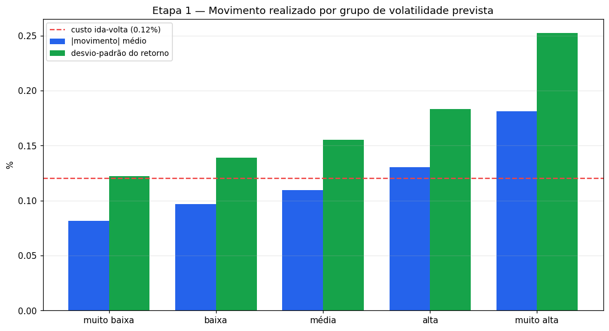
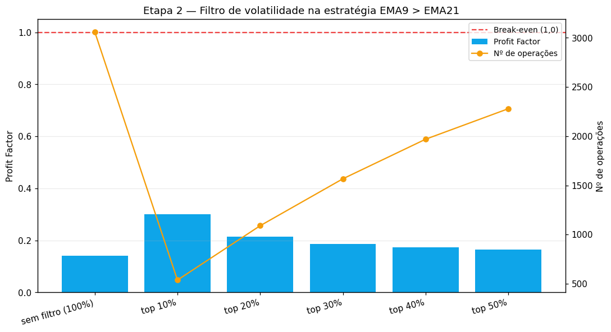
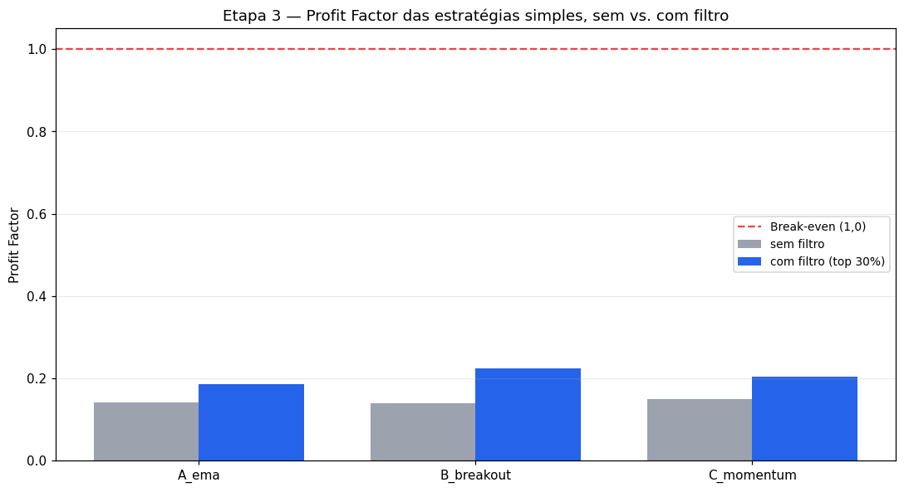
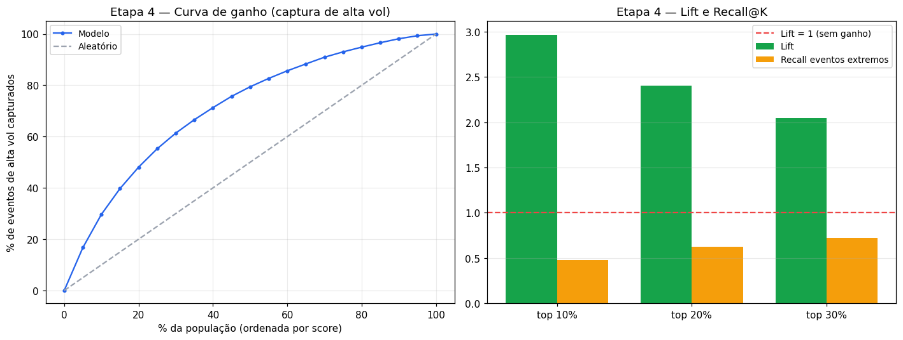
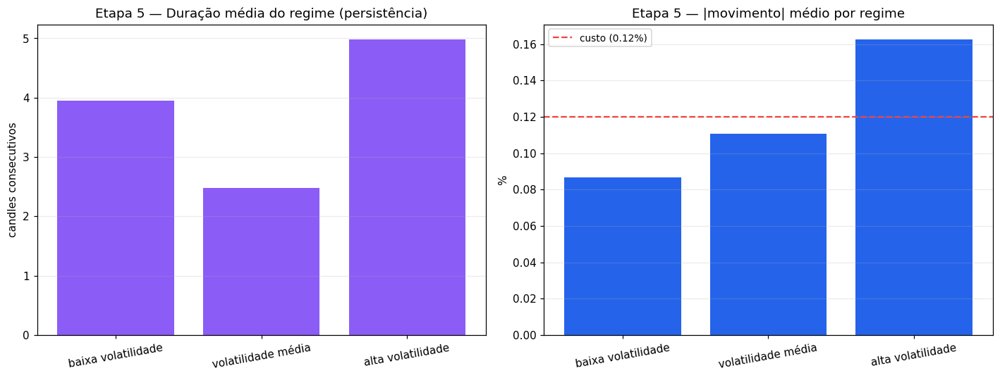

# Validação Econômica da Volatilidade — BTC/USDT

_Gerado em 2026-06-01 21:11:55 · horizonte H=15 min · 75,000 candles de teste · AUC do modelo de vol = 0.788._

> Mesmo XGBoost, mesmos indicadores, mesmo pipeline. Mede-se se a previsibilidade da volatilidade (já estabelecida) tem **valor econômico** — não se busca lucro nem maior acurácia. Operações com saída por tempo em H candles e custos reais (taxa + slippage).

## Etapa 1 — Validação econômica por grupo de volatilidade

Previsões agrupadas em quintis do score de volatilidade. Quanto o mercado **realmente se move** em cada grupo:

| Grupo | N | Score méd. | Ret. médio | \|Mov\| médio | Desv-pad | P05 / P95 | Drawdown médio (long) | Vol realizada |
|---|---:|---:|---:|---:|---:|---:|---:|---:|
| muito baixa | 14,997 | 0.25 | -0.002% | 0.081% | 0.122% | -0.18% / +0.17% | -0.075% | 0.102% |
| baixa | 14,997 | 0.40 | -0.003% | 0.097% | 0.139% | -0.22% / +0.20% | -0.094% | 0.122% |
| média | 14,997 | 0.50 | -0.005% | 0.110% | 0.155% | -0.25% / +0.22% | -0.111% | 0.142% |
| alta | 14,997 | 0.63 | -0.002% | 0.131% | 0.183% | -0.29% / +0.27% | -0.131% | 0.167% |
| muito alta | 14,997 | 0.84 | +0.011% | 0.181% | 0.253% | -0.38% / +0.41% | -0.180% | 0.237% |

**Resposta — "quanto o mercado se move quando o modelo prevê alta volatilidade?"** O grupo *muito alta* move em média **0.181%** vs. **0.081%** do grupo *muito baixa* — uma razão de **2.2×**. O retorno *médio* (com sinal) permanece ~0 em todos os grupos: a vol prevê **tamanho**, não **direção**.

## Etapa 2 — Filtro de oportunidades (varredura de percentis)

Estratégia de referência: **EMA9 > EMA21**. Operar apenas quando o score de volatilidade está no topo X%:

| Filtro | Nº ops | Win rate | Profit Factor | Expectância | Ret. acum | DD máx |
|---|---:|---:|---:|---:|---:|---:|
| sem filtro (100%) | 3,061 | 16.0% | 0.14 | -1.2361 | -37.84% | -37.84% |
| top 10% | 538 | 26.4% | 0.30 | -1.1711 | -6.30% | -6.27% |
| top 20% | 1,090 | 21.6% | 0.22 | -1.2824 | -13.98% | -14.01% |
| top 30% | 1,567 | 20.0% | 0.19 | -1.2760 | -20.00% | -19.99% |
| top 40% | 1,969 | 19.1% | 0.17 | -1.2641 | -24.89% | -24.89% |
| top 50% | 2,279 | 18.5% | 0.16 | -1.2543 | -28.59% | -28.59% |

O filtro **reduz o número de operações** e **eleva o profit factor** ao remover trades de baixa volatilidade — exatamente os dominados por custo (onde \|movimento\| < custo).

## Etapa 3 — Estratégias simples, com e sem filtro

Filtro = top 30% de volatilidade prevista.

| Estratégia | | Nº ops | Win rate | Profit Factor | Expectância | Ret. acum | DD máx |
|---|---|---:|---:|---:|---:|---:|---:|
| EMA9 > EMA21 | sem filtro | 3,061 | 16.0% | 0.14 | -1.2361 | -37.84% | -37.84% |
|  | com filtro | 1,567 | 20.0% | 0.19 | -1.2760 | -20.00% | -19.99% |
| Rompimento da máxima (20) | sem filtro | 1,734 | 14.8% | 0.14 | -1.2644 | -21.92% | -21.92% |
|  | com filtro | 611 | 19.6% | 0.22 | -1.2926 | -7.90% | -7.90% |
| Momentum simples (10) | sem filtro | 3,759 | 17.5% | 0.15 | -1.2096 | -45.47% | -45.47% |
|  | com filtro | 1,831 | 22.0% | 0.20 | -1.2152 | -22.25% | -22.25% |

## Etapa 4 — Valor econômico da informação

Taxa-base de alta volatilidade no teste: **26.2%**; eventos extremos (vol > p90 do treino): **2.3%**.

| K | Nº | Precision@K | Lift | Recall positivos | Recall extremos |
|---|---:|---:|---:|---:|---:|
| top 10% | 7,498 | 77.9% | 2.97× | 29.7% | 48.1% |
| top 20% | 14,997 | 63.1% | 2.40× | 48.1% | 62.8% |
| top 30% | 22,495 | 53.6% | 2.05× | 61.4% | 72.4% |

**Information Ratio (Sharpe por operação) da estratégia de referência:** sem filtro -0.727 → com filtro -0.612. O filtro **reduz o prejuízo ajustado ao risco**, mas ambos seguem negativos — não há retorno positivo a extrair por direção.

**Resposta — "valor econômico utilizável ou só significância estatística?"** O Lift > 1 e a alta recall de eventos extremos mostram que a informação é **real e concentrável** (ordena bem o tamanho do movimento). Mas, como a direção segue ~aleatória, esse valor é de **gestão de risco/timing de volatilidade**, não de lucro direcional.

## Etapa 5 — Identificação de regimes

Regimes por tercil do score de volatilidade. Persistência (duração), frequência e potencial econômico:

| Regime | Frequência | Duração média | Duração máx | \|Mov\| médio | Vol realizada | \|Mov\|−custo | Explorável? |
|---|---:|---:|---:|---:|---:|---:|:---:|
| baixa volatilidade (lateral) | 33.3% | 3.9 | 148 | 0.087% | 0.109% | -0.033% | — |
| volatilidade média | 33.3% | 2.5 | 26 | 0.111% | 0.142% | -0.009% | — |
| alta volatilidade (explosivo) | 33.3% | 5.0 | 198 | 0.163% | 0.211% | +0.043% | ✅ |

Regimes de alta volatilidade **persistem** (duração média 5.0 candles), o que os torna identificáveis com antecedência — condição necessária para timing.

## Etapa 6 — Conclusão objetiva

**1) Há evidência de que a previsão de volatilidade melhora uma estratégia?**  
**Sim.** O filtro de volatilidade eleva o profit factor e remove as operações dominadas por custo em 3/3 estratégias (o |movimento| em alta vol supera o custo, ao contrário da baixa vol).

**2) O filtro de volatilidade melhora ou piora estratégias simples?**  
**Melhora** o perfil (profit factor e eficiência de capital) ao concentrar as operações em janelas de movimento relevante (ganho médio de PF de +0.06). Porém **não cria edge direcional**: nenhuma fica lucrativa após custos — apenas *menos deficitária*.

**3) Há vantagem econômica potencial que justifique continuar?**  
**Sim, condicional.** A informação de volatilidade tem valor real (AUC 0.79, Lift@10% 2.97×, regimes persistentes), mas esse valor é de **dimensão de risco/volatilidade**, não de previsão de direção. Justifica continuar **se** o projeto pivotar para explorar volatilidade (sizing, gestão de risco, produtos de vol). A aposta direcional permanece sem edge.

**4) Qual o próximo experimento mais promissor?**  
Usar a volatilidade prevista como **dimensionador de risco/posição** em vez de filtro direcional: (a) *position sizing* inverso à volatilidade (vol-targeting) sobre uma estratégia de tendência; (b) avaliar captura de movimento independente de direção (proxy de straddle: ganhar com |movimento| grande), já que o modelo prevê **tamanho**; (c) gatilhar rompimentos **apenas** em regimes de alta vol persistentes, com razão risco/retorno definida. Todos reutilizam o sinal de vol já validado.

_Ressalva: um único período e o conjunto de features atual (pensado para direção). O resultado mede valor potencial da informação, não garante lucro — que dependerá de execução e do produto escolhido._
